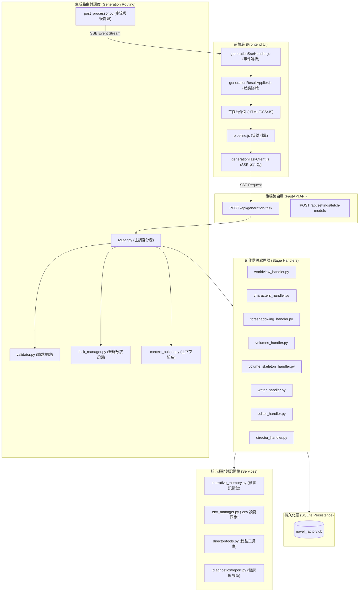

# AI Novel Factory (AI 小說工廠)

> 智能長篇小說創作系統 — 採用多 AI 代理協作（Multi-Agent Collaboration）與總監驅動管線（Director-Driven Pipeline）架構。

---

<!-- 頁籤式導航列 (Tab Navigation Bar) -->
| 📖 [專案總覽](#-1-專案總覽) | 🚀 [快速開始](#-2-快速開始與環境變數) | 🏛️ [技術架構詳解](#-3-系統技術架構-架構頁籤) | 📡 [核心 API](#-4-核心-api-端點) | 🧪 [測試與規範](#-5-測試與開發規範) |
| :---: | :---: | :---: | :---: | :---: |

---

## 📖 1. 專案總覽

AI 小說工廠是一個高度模組化、多代理協作的長篇小說自動創作系統。系統透過 7 個核心創作階段（Stage）與 1 個智慧總監評估階段，由 AI 總監（AI Director Copilot）依序派發任務、審查品質、修補錯誤，實現百萬字級長篇小說的結構化生成。

### 核心創作階段一覽

| 順序 | Stage 名稱 | 負責 Agent | 角色定位與核心職掌 |
|:---:|:---|:---|:---|
| 1 | `worldview` | **Story Architect** (故事結構架構師) | 構建核心世界觀、主線多幕結構、力量體系與角色登場策略 |
| 2 | `characters` | **Character Designer** (角色設計大師) | 建立主要角色聖經（Bible）、性格標籤、背景故事與成長弧線 |
| 3 | `foreshadowing`| **Foreshadowing Orchestrator** (伏筆編織師) | 全局伏筆種子埋設、觸發章節與關鍵高潮轉折點編排 |
| 4 | `volumes` | **Volumes Planner** (篇卷結構規劃師) | 劃分全書 10~20 卷宏觀節奏與卷主線目標 |
| 5 | `volume_skeleton`| **Volume Skeleton Planner** (骨架規劃師) | 規劃逐卷逐章細部骨架大綱（40~50 章/卷） |
| 6 | `writer` | **Chapter Writer** (正文寫作作家) | 撰寫高品質小說正文（單章 1500~3000 字） |
| 7 | `editor` | **Editor Agent** (精緻文風編輯) | 潤色行文修辭、統一用詞規範與文風昇華 |
| — | `evaluate` | **AI Director Copilot** (總監評估調度) | 階段性產出品質審查、錯誤自癒與管線下一步決策 |

```
Write_Novel/
├── backend/
│   ├── app.py                    # FastAPI 核心應用與全域路由註冊
│   ├── api/                      # RESTful 資源路由層 (novels, settings, export, volumes)
│   ├── agents/                   # 獨立 Agent 執行包 (architect, character, writer, etc.)
│   ├── common/                   # LLM 傳輸、設定解析與全域工具 (llm.py)
│   ├── generation/               # 統一生成引擎 (routing, orchestration, handlers)
│   ├── persistence/              # SQLite 持久化層與 Repositories (novel_factory.db)
│   ├── prompts/                  # 提示詞模板與上下文組裝
│   ├── schemas/                  # Pydantic 輸出資料結構與校驗
│   └── services/                 # 記憶體服務、診斷工具、環境變數管理 (env_manager.py)
├── frontend/                     # 前端單頁應用程式靜態資源 (HTML / Vanilla CSS / ES Modules)
├── data/                         # 資料庫檔案與黃金規則庫
├── docs/                         # 專案詳細架構與開發指引文件
└── test_all.py                   # 單一整合型全自動化測試套件
```

---

## 🚀 2. 快速開始與環境變數

### 啟動服務

```bash
# 1. 安裝必要依賴
pip install -r requirements.txt

# 2. 啟動 FastAPI 本地開發伺服器
python -m uvicorn backend.app:app --host 127.0.0.1 --port 8000 --reload

# 3. 於瀏覽器開啟工作台
http://127.0.0.1:8000
```

### 環境變數設定檔 (`.env`)

系統支援於網頁工作台「**模型設置 & Agent 團隊 API 金鑰**」介面直接編輯、向端點動態查詢 `/models` 清單，並在點擊儲存時**即時同步寫入根目錄 `.env` 檔案**。

<details>
<summary><b>點擊展開檢視 .env 完整範本與參數說明</b></summary>

```dotenv
# ==========================================
# AI Novel Factory - Environment Configuration
# ==========================================

# --- 各 Agent 獨立 API Key (NVIDIA / OpenAI / Custom) ---
NVIDIA_API_KEY_GLOBAL="nvapi-YOUR_KEY_HERE"
NVIDIA_API_KEY_ARCHITECT="nvapi-YOUR_KEY_HERE"
NVIDIA_API_KEY_CHARACTER="nvapi-YOUR_KEY_HERE"
NVIDIA_API_KEY_VOLUMES="nvapi-YOUR_KEY_HERE"
NVIDIA_API_KEY_VOLUME_SKELETON="nvapi-YOUR_KEY_HERE"
NVIDIA_API_KEY_PLOT="nvapi-YOUR_KEY_HERE"
NVIDIA_API_KEY_WRITER="nvapi-YOUR_KEY_HERE"
NVIDIA_API_KEY_EDITOR="nvapi-YOUR_KEY_HERE"
NVIDIA_API_KEY_COPILOT="nvapi-YOUR_KEY_HERE"

# --- 全域預設設定 (Global Defaults) ---
MODEL_GLOBAL="openai/gpt-oss-120b"
BASE_URL_GLOBAL="https://integrate.api.nvidia.com/v1"
TEMPERATURE_GLOBAL=1.0
TOP_P_GLOBAL=0.95
MAX_TOKENS_GLOBAL=16384
ENABLE_THINKING_GLOBAL=0

# --- 各代理個別覆寫設定範例 ---
MODEL_ARCHITECT="openai/gpt-oss-120b"
BASE_URL_ARCHITECT="https://integrate.api.nvidia.com/v1"
TEMPERATURE_ARCHITECT=1.0
TOP_P_ARCHITECT=0.95
MAX_TOKENS_ARCHITECT=16384
ENABLE_THINKING_ARCHITECT=0

DEFAULT_BASE_URL="https://integrate.api.nvidia.com/v1"
DEFAULT_TEMPERATURE=1.0
DEFAULT_TOP_P=0.95
DEFAULT_MAX_TOKENS=16384
DEFAULT_ENABLE_THINKING=0
```

| 變數前綴/名稱 | 類型 | 說明 |
|:---|:---:|:---|
| `NVIDIA_API_KEY_{AGENT}` | String | 該 Agent 專用 API Key；留空時自動繼承 Global Key |
| `MODEL_{AGENT}` | String | 該 Agent 專用模型名稱；留空時繼承 Global Model |
| `BASE_URL_{AGENT}` | String | 該 Agent 呼叫端點 URL；留空時繼承 Global Base URL |
| `TEMPERATURE_{AGENT}` | Float | 生成多樣性溫度 (0.0 ~ 2.0) |
| `TOP_P_{AGENT}` | Float | 核採樣機率閾值 (0.0 ~ 1.0) |
| `MAX_TOKENS_{AGENT}` | Int | 單次最大輸出 Token 數量 |
| `ENABLE_THINKING_{AGENT}` | Int (0/1) | 是否啟用推理思考模式（Reasoning Stream） |

</details>

---

## 🏛️ 3. 系統技術架構 (架構頁籤)

以下收錄系統各模組技術細節，可點擊各主題分頁展開閱讀：



<details open>
<summary><b>📑 頁籤 A：前端管線與 SSE 協議 (Frontend Pipeline & SSE)</b></summary>

### 核心前端模組
- **`pipeline.js`**：管線主控引擎，負責管理 `isPipelineRunning` 狀態、階段切換與總監審查循環。
- **`generationTaskClient.js`**：封裝底層 SSE 請求，支援連線中斷自動退避重試（Exponential Backoff）。
- **`generationSseHandler.js`**：即時解析後端推播之 `thinking`、`content`、`error`、`retrying` 與 `done` 封包。
- **`ui/settings.js`**：模型設置管理介面，實作 Base URL 動態拉取模型清單、快取與 `.env` 同步寫入。

### SSE 串流封包規格
```text
data: {"type": "thinking", "delta": "正在推導主角動機..."}
data: {"type": "content", "delta": "第一章 正文內容..."}
data: {"type": "retrying", "message": "格式校驗修正中..."}
data: {"type": "done", "ok": true, "result": {...}, "patches": [...], "lock_released": true}
```

</details>

<details>
<summary><b>📑 頁籤 B：後端生成路由與調度 (Generation Routing & Orchestration)</b></summary>

### 生成路由核心架構
- **`router.py`**：生成任務的統一進入點，協調生命週期：`驗證` ➔ `取鎖` ➔ `建構上下文` ➔ `派發 Handler` ➔ `後處理與存檔` ➔ `釋放鎖`。
- **`lock_manager.py`**：小說級別管線鎖（Pipeline Lock），防止同一小說專案併發寫入衝突，支援定期 Heartbeat 續期機制。
- **`context_builder.py`**：智能彙整當前創作階段所需之世界觀、前卷記憶、角色狀態與歷史摘要。
- **`post_processor.py`**：負責串流結果攔截、JSON 格式強制解析、自動儲存至 SQLite 並產生增量 JSON Patches。

</details>

<details>
<summary><b>📑 頁籤 C：Agent 系統與總監審查機制 (Agent System & Director)</b></summary>

### 總監評估雙層機制 (Two-Tier Evaluation)
1. **硬性格式檢查 (Hard Schema Check)**：`evaluate_output` 嚴格校驗 JSON 欄位完整性、章節索引連續性、空章節偵測。若失敗則自動重試或由總監介入修復。
2. **內容品質審查 (Quality Inspection)**：透過 `inspect_content_block` 與 `expand_collapsed_json` 工具分段展開大綱與章節，評估伏筆呼應度與行文節奏。

### 敘事記憶系統 (`narrative_memory.py`)
- **章節記憶 (Chapter Memory)**：記錄每章的出場角色、狀態變更、關鍵事件與情報揭露。
- **篇卷弧線摘要 (Arc Summaries)**：自動壓縮歷史章節為卷級記憶，保持超長篇小說上下文不溢出且設定不吃書。

</details>

<details>
<summary><b>📑 頁籤 D：持久化與資料庫 (Persistence & SQLite Schema)</b></summary>

### 資料表結構
- `novels`：小說基本資訊、主線進度與 Prompt。
- `worldbuilding`：世界觀背景設定、地理勢力與力量等級。
- `characters`：角色資料卡與關係網絡。
- `volumes`：篇卷劃分、卷大綱與目標。
- `chapters`：章節大綱、正文草稿與潤色終稿。
- `foreshadowing`：伏筆種子、狀態（已埋下/已揭露）與關聯章節。
- `agent_configs`：各 Agent 之資料庫設定備份。
- `pipeline_locks`：管線鎖定狀態與 Heartbeat 時間戳。

</details>

---

## 📡 4. 核心 API 端點

| HTTP 方法 | API 路徑 | 說明 | 備註 |
|:---:|:---|:---|:---|
| `POST` | `/api/generation-task` | **統一生成調度端點** | 支援 SSE 串流與 JSON 同步模式 |
| `GET` | `/api/settings` | 獲取當前所有 Agent 之配置快照 | 整合 `.env` 與資料庫設定 |
| `POST` | `/api/settings` | 儲存 Agent 設定 | **即時同步修改專案根目錄 `.env`** |
| `POST` | `/api/settings/fetch-models` | **動態查詢可用模型清單** | 支援 OpenAI / NVIDIA / Ollama `/models` 端點 |
| `GET` | `/api/novels` | 列出所有小說專案 | 支援分頁與狀態統計 |
| `POST` | `/api/novels` | 建立全新小說專案 | 包含標題、題材、風格設定 |
| `GET` | `/api/novels/{id}` | 取得指定小說完整資料 | 含世界觀、角色、篇卷與章節全貌 |
| `POST` | `/api/novels/{id}/copy` | 複製小說專案 | 複製同風格與設定之空書目專案 |
| `GET` | `/api/novels/{id}/export` | 匯出小說全書 | 支援 **離線便攜 HTML 閱讀器** 與純文字 TXT |

---

## 🧪 5. 測試與開發規範

本專案遵循嚴格的品質與跨平台相容規範：

- **純 Windows / PowerShell 環境相容**：所有指令與路徑處理完全適配 Windows，禁止相依 Linux 特有命令。
- **全流程 UTF-8 強制編碼**：所有中文字串與檔案讀寫強制宣告 `encoding='utf-8'`，嚴防 `cp950` 編碼異常。
- **單一整合測試套件**：所有單元測試、API 整合測試、模型查詢與 `.env` 同步驗證皆整合於單一檔案 `test_all.py`。

### 執行完整自動化測試

```powershell
C:\Users\user\venv\Scripts\python.exe test_all.py
```

---

## 📚 相關文檔

- 📖 [使用者操作指南 (USER_GUIDE.md)](USER_GUIDE.md)
- 💻 [開發者指南 (DEVELOPER_GUIDE.md)](DEVELOPER_GUIDE.md)
