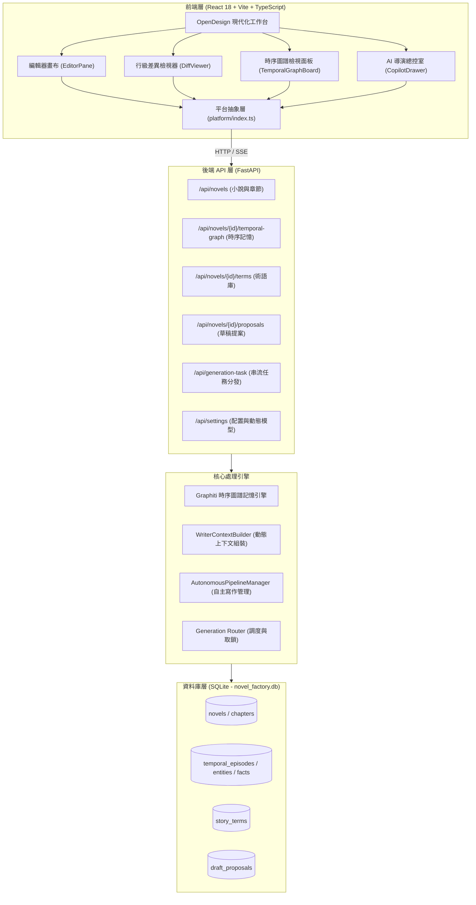

# AI Novel Factory (AI 小說工廠) v4.0.0

> 智能長篇小說創作系統 — 採用多 AI 代理協作（Multi-Agent Collaboration）、Graphiti 時序動態記憶圖譜（Temporal Knowledge Graph）、OpenDesign 極簡暗黑架構與 React 現代化工作台。

---

<!-- 頁籤式導航列 -->
| [專案總覽](#1-專案總覽) | [快速開始](#2-快速開始) | [使用指南](#3-使用指南) | [技術架構](#4-系統技術架構) | [API 端點](#5-核心-api-端點) | [測試與授權](#6-測試與授權) |
| :---: | :---: | :---: | :---: | :---: | :---: |

---

## 1. 專案總覽

AI 小說工廠是一個多代理協作的長篇小說自動創作系統。透過 7 個核心創作階段與 AI 總監評估，結合 **Graphiti 時序動態記憶圖譜**，實現百萬字級長篇小說的結構化生成與前後文連貫性保障。

### 核心創作階段

| 順序 | Stage | Agent | 職掌 |
|:---:|:---|:---|:---|
| 1 | `worldview` | Story Architect | 世界觀、多幕結構、力量體系 |
| 2 | `characters` | Character Designer | 角色聖經、性格、成長弧線 |
| 3 | `foreshadowing` | Foreshadowing Orchestrator | 伏筆埋設與回收編排 |
| 4 | `volumes` | Volumes Planner | 10~20 卷宏觀節奏 |
| 5 | `volume_skeleton` | Skeleton Planner | 逐卷逐章細部骨架 |
| 6 | `writer` | Chapter Writer | 正文撰寫（1500~3000 字/章） |
| 7 | `editor` | Editor Agent | 潤色修辭、審閱提案 |
| — | `evaluate` | AI Director Copilot | 品質審查、錯誤自癒 |

### 專案目錄結構

```
Write_Novel/
├── version.json                  # 全專案唯一版本來源 (SSOT, v4.0.0)
├── THIRD_PARTY_NOTICES.md        # 第三方開源授權與 Clean-Room 淨室聲明
├── pytest.ini                    # Pytest 自動化測試配置
├── requirements.txt              # Python 後端依賴清單
├── app.py                        # Hugging Face Spaces 入口 (Gradio + FastAPI)
├── build_app.py                  # 本地一鍵打包腳本 (APK / Electron / EXE)
├── electron_backend.py           # Electron 後端無頭入口
├── backend/                      # Python FastAPI 後端
│   ├── app.py                    # FastAPI 核心應用、路由註冊與靜態發布包掛載
│   ├── agents/                   # 7 大創作 Agent (architect, character, writer, editor...)
│   ├── api/                      # RESTful 資源路由層
│   │   ├── novels/               # 小說 CRUD、章節與大綱存取
│   │   ├── temporal_graph/       # Graphiti 時序記憶圖譜與切片端點
│   │   ├── terms/                # 故事專用術語庫端點
│   │   ├── proposals/            # 草稿修訂提案與 Diff 套用端點
│   │   ├── settings/             # 系統設定與動態模型探索
│   │   ├── autonomous/           # 全自動自主寫作管線控制
│   │   ├── export/               # 多格式導出 (TXT / Markdown / HTML)
│   │   ├── volumes/              # 篇卷結構 API
│   │   ├── diagnostics/          # 系統診斷端點
│   │   └── sync/                 # HF Storage Bucket 同步端點
│   ├── common/                   # 全域版本讀取、LLM 介面、工具函數
│   ├── generation/               # 生成路由引擎 (routing, orchestration, handlers)
│   ├── models/                   # LLM 客戶端與輸出解析器
│   ├── prompts/                  # Prompt 模板管理與約束注入
│   ├── schemas/                  # JSON Schema 驗證與類型定義
│   ├── persistence/              # SQLite 持久化層 (schema.py, repositories/)
│   ├── services/                 # 核心服務引擎
│   │   ├── graphiti/             # Graphiti 時序圖譜記憶引擎
│   │   ├── context/              # WriterContextBuilder 動態上下文組裝
│   │   ├── director/             # AI Director Copilot 總監服務
│   │   ├── autonomous_pipeline.py# 無人值守自主寫作排程器
│   │   ├── hf_sync.py            # Hugging Face Storage Bucket 同步
│   │   └── ...                   # gold_rules, foreshadowing, incremental_patch 等
│   └── data/                     # 後端內建資料 (gold_rules/)
├── electron/                     # Electron 桌面殼 (Windows portable)
├── frontend/                     # React 18 + TypeScript + Vite
│   ├── package.json              # 前端相依套件
│   ├── vite.config.ts            # Vite 配置 (base: './', API Proxy)
│   ├── capacitor.config.ts       # Capacitor Android 封裝配置
│   ├── src/
│   │   ├── api/                  # 統一型別化 API 客戶端
│   │   ├── components/
│   │   │   ├── common/           # Button, Badge, StatusDot, ModelChip, Icons (SVG)
│   │   │   ├── layout/           # ActivityRail, ExplorerDrawer, BottomDock, MobileNav
│   │   │   ├── editor/           # EditorPane, DiffViewer, ProposalInbox, TaskPicker
│   │   │   ├── graph/            # TemporalGraphBoard
│   │   │   ├── copilot/          # CopilotDrawer, StageSelector
│   │   │   ├── novel/            # CreateNovelModal, DeleteNovelModal, ResetNovelModal
│   │   │   └── settings/         # SettingsModal, TermsModal
│   │   ├── hooks/                # useNovel, useTemporalGraph, useProposals, useExpansionSync
│   │   ├── platform/             # 平台抽象層 (Web, Android, Desktop)
│   │   ├── storage/              # 本地狀態管理
│   │   ├── types/                # 全域 TypeScript 型別定義
│   │   ├── styles/               # opendesign.css (嚴格 0 inline styles)
│   │   └── utils/                # diff.ts (LCS 行級 Diff), clipboard.ts, time.ts
│   └── dist/                     # 前端生產環境打包產物
├── tests/                        # 自動化測試套件
├── tools/                        # 診斷與清理工具腳本
├── scripts/                      # 部署同步腳本
├── dist-packages/                # 本地打包產物輸出目錄
└── data/                         # 本地資料庫與快取 (novel_factory.db)
```

---

## 2. 快速開始

### 系統需求
- **作業系統**：Windows 10 / 11
- **Python**：3.10+（推薦使用虛擬環境 `C:\Users\Administrator\venv\Scripts\python.exe`）
- **Node.js**：18+（推薦 v20+）
- **Electron**：33+（桌面版打包，選用）

### 啟動服務

#### 1. 前端構建（初次運行或代碼變更時）
```powershell
cd frontend
npm install
npm run build
cd ..
```
> `npm run build` 會產出高效率靜態發布包至 `frontend/dist/`。

#### 2. 啟動後端服務
```powershell
C:\Users\Administrator\venv\Scripts\python.exe -m uvicorn backend.app:app --host 127.0.0.1 --port 8000 --reload
```

#### 3. 進入創作工作台
開啟瀏覽器訪問：
👉 **[http://127.0.0.1:8000/](http://127.0.0.1:8000/)**
FastAPI 會自動服務 `frontend/dist/` 所構建出的現代化 OpenDesign 工作台。

---

## 3. 使用指南

### 介面佈局
工作台採用 4 欄 IDE 佈局：

```
┌────┬──────────────┬────────────────────────────────┬──────────────┐
│ 活 │   作品導航   │          中央創作主畫布         │  AI 導演總控 │
│ 動 │   (目錄樹)   │       (正文 / Diff / 圖譜)     │    (Copilot) │
│ 列 │              │                                │              │
│ 48 │  · 作品切換  │  · 章節正文即時編輯            │  · 階段選擇  │
│ px │  · 章節目錄  │  · 審閱修訂對比 (Diff)         │  · 自主寫作  │
│    │  · 增減章節  │  · 時序記憶圖譜 (Graphiti)     │  · 推理串流  │
├────┴──────────────┴────────────────────────────────┴──────────────┤
│ 底部工作列：即時推理與生成日誌 / 自主寫作進度 (可收合)              │
└──────────────────────────────────────────────────────────────────┘
```

- **左側活動列 (48px)**：章節編輯器、審閱對比、時序圖譜、術語庫、系統設定。
- **中央主畫布**：支援正文編輯、審閱對比、時序圖譜切換。
- **右側導演 (320px)**：階段派發器、自主寫作、推理串流。
- **行動端 (< 768px)**：底部 3 按鈕導航（目錄、正文、導演）。

### 三種創作模式

**A. 純手動寫作**
1. 左側目錄選取章節 → 中央畫布即時載入。
2. 輸入文字，按 `Ctrl + S` 儲存。
3. 點擊「一鍵複製」將全章複製至剪貼簿。

**B. 人機協同審閱**
1. 右側導演面板選擇「審閱修訂」→ 輸入要求 → 點擊「執行階段生成」。
2. AI 產出修改建議，存入「草稿建議收件箱」。
3. 點擊「審閱對比 (Diff)」檢視差異（綠色新增 / 紅色刪除）。
4. 點擊「一鍵套用」或「放棄建議」。

**C. 全自動自主寫作**
1. 點擊「自主寫作」啟動。
2. 後端自動推進：世界觀 → 角色 → 大綱 → 逐章撰寫 → 時序記憶登錄。
3. 可隨時關閉瀏覽器，後端持續運行；再次開啟自動輪詢進度。

### Graphiti 時序記憶圖譜
解決 AI 寫作遺忘前期設定的問題：
- **時序切片**：僅展示當前章節有效的事實。
- **事實作廢**：點擊「作廢」輸入原因，防止後續章節錯誤引用。
- **自動提取**：撰寫完正文後，點擊「本章事實自動提取」自動提煉結構化事實。

### 術語庫
將專有名詞提升為 **Prompt 強制約束**：
1. 點擊左側「故事專用術語庫」→「新增術語」。
2. 填寫名稱、分類（通用/修煉體系/地理/功法/宗門）與定義約束。
3. 後端自動將術語表注入 Agent 提示詞，確保名詞 100% 一致。

### 系統設定
點擊活動列底部齒輪：
1. API Base URL：輸入 OpenAI 相容端點（NVIDIA NIM、OpenAI、Ollama）。
2. API Key：輸入金鑰。
3. 動態讀取可用模型：即時查詢並渲染為標籤選擇片。
4. Temperature / Thinking Stream：調整生成參數。

### 小說匯出
- **TXT (`format=txt`)**：純文字，適合電子書閱讀器。
- **Markdown (`format=markdown`)**：保留世界觀、角色、大綱與正文。
- **HTML (`format=html`)**：內建夜間閱讀主題，單檔離線閱讀。

---

## 4. 系統技術架構



---

## 5. 核心 API 端點

| HTTP 方法 | API 路徑 | 說明 | 備註 |
|:---:|:---|:---|:---|
| `POST` | `/api/generation-task` | **統一生成調度端點** | 支援 SSE 串流 (`text/event-stream`) |
| `GET` | `/api/novels/{id}/temporal-graph` | **時序記憶圖譜切片** | 支援 `?chapter=N` 查詢有效事實 |
| `POST` | `/api/novels/{id}/temporal-graph/facts` | 新增時序事實命題 | 紀錄起始章節 `valid_from_chapter` |
| `POST` | `/api/novels/{id}/temporal-graph/facts/{fid}/invalidate` | **作廢時序事實** | 登記作廢章節與取代資訊 |
| `POST` | `/api/novels/{id}/temporal-graph/extract-from-chapter` | **章節事實自動提取** | 呼叫 AI 解析正文並登錄實體與事實 |
| `GET` | `/api/novels/{id}/terms` | 取得小說專用術語庫 | 可依 `?category=...` 篩選 |
| `POST` | `/api/novels/{id}/terms` | 新增故事術語 | 術語定義自動作為 Prompt 約束注入 |
| `GET` | `/api/novels/{id}/proposals` | 取得草稿修改提案清單 | 支援依章節與狀態篩選 |
| `POST` | `/api/novels/{id}/proposals/{pid}/apply` | **一鍵套用修改提案** | 將提案覆蓋章節正文並更新狀態 |
| `POST` | `/api/pipeline/auto-run` | 啟動全自動自主寫作 | 後端背景多執行緒自驅推進 |
| `GET` | `/api/pipeline/auto-status` | 查詢自主寫作即時狀態 | 輪詢當前章節、階段與進度 |
| `POST` | `/api/settings/fetch-models` | 動態探索端點可用模型 | 支援 OpenAI / NVIDIA / Ollama |
| `GET` | `/api/diagnostics/health` | 系統健康診斷 | 資料庫與服務狀態 |
| `POST` | `/api/sync/backup` | 手動觸發資料庫備份 | 同步至 HF Storage Bucket |
| `GET` | `/api/sync/status` | 查詢同步狀態 | 備份時間與版本資訊 |

---

## 6. 測試與授權

### 自動化測試套件
使用專用虛擬環境執行全套測試：
```powershell
C:\Users\Administrator\venv\Scripts\python.exe -m pytest
```
- **測試涵蓋範圍**：前端構建整合、時序事實生命週期、術語庫約束、提案流程、WriterContextBuilder 動態注入、黃金規則治理、Agent 工具調用死循環防護、敘事基準測試等。
- 詳見 `tests/` 目錄。

### 開源授權與 Clean-Room 聲明
詳見 [THIRD_PARTY_NOTICES.md](THIRD_PARTY_NOTICES.md)。本專案嚴格遵循 Clean-Room 獨立開發原則，所有 React 元件、Hook、演算法（包括 LCS Line Diff）皆為獨立全新實作，無任何複製、移植或機械改寫。

---

## 相關文檔

- [開發者手冊 (DEVELOPER_GUIDE.md)](DEVELOPER_GUIDE.md)
- [第三方授權告示 (THIRD_PARTY_NOTICES.md)](THIRD_PARTY_NOTICES.md)
