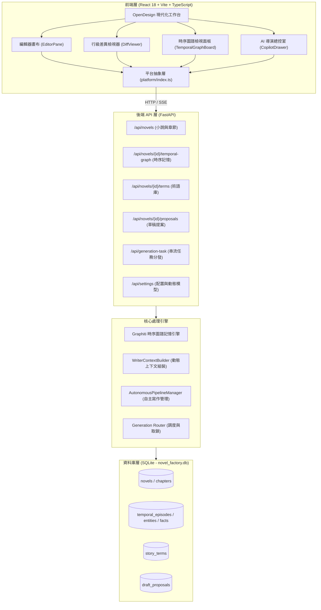

# AI Novel Factory (AI 小說工廠) v4.0.0

> 智能長篇小說創作系統 — 採用多 AI 代理協作（Multi-Agent Collaboration）、Graphiti 時序動態記憶圖譜（Temporal Knowledge Graph）、OpenDesign 極簡暗黑架構與 React 現代化工作台。

---

<!-- 頁籤式導航列 (Tab Navigation Bar) -->
| [專案總覽](#-1-專案總覽) | [快速開始](#-2-快速開始與環境配置) | [核心新特性 (v4.0.0)](#-3-v400-核心新特性) | [系統技術架構](#-4-系統技術架構) | [核心 API 端點](#-5-核心-api-端點) | [測試與開源授權](#-6-測試與開源授權界限) |
| :---: | :---: | :---: | :---: | :---: | :---: |

---

## 1. 專案總覽

AI 小說工廠是一個高度模組化、多代理協作的長篇小說自動創作與輔助寫作系統。系統透過 7 個核心創作階段（Stage）與智慧總監評估階段，由 AI 總監（AI Director Copilot）依序派發任務、審查品質、修補錯誤，並結合 **Graphiti 時序動態記憶圖譜**，實現百萬字級長篇小說的結構化生成與前後文連貫性保障。

### 核心創作階段一覽

| 順序 | Stage 名稱 | 負責 Agent | 角色定位與核心職掌 |
|:---:|:---|:---|:---|
| 1 | `worldview` | **Story Architect** (故事結構架構師) | 構建核心世界觀、主線多幕結構、力量體系與角色登場策略 |
| 2 | `characters` | **Character Designer** (角色設計大師) | 建立主要角色聖經（Bible）、性格標籤、背景故事與成長弧線 |
| 3 | `foreshadowing`| **Foreshadowing Orchestrator** (伏筆編織師) | 全局伏筆種子埋設、觸發章節與關鍵高潮轉折點編排 |
| 4 | `volumes` | **Volumes Planner** (篇卷結構規劃師) | 劃分全書 10~20 卷宏觀節奏與卷主線目標 |
| 5 | `volume_skeleton`| **Volume Skeleton Planner** (骨架規劃師) | 規劃逐卷逐章細部骨架大綱（40~50 章/卷） |
| 6 | `writer` | **Chapter Writer** (正文寫作作家) | 結合時序記憶與術語庫撰寫高品質小說正文（單章 1500~3000 字） |
| 7 | `editor` | **Editor Agent** (精緻文風編輯) | 潤色行文修辭、產出審閱修改提案與文風昇華 |
| — | `evaluate` | **AI Director Copilot** (總監評估調度) | 階段性產出品質審查、錯誤自癒與管線下一步決策 |

### 專案目錄結構

```
Write_Novel/
├── version.json                  # 全專案唯一版本來源 (Single Source of Truth, v4.0.0)
├── THIRD_PARTY_NOTICES.md        # 第三方開源授權與 Clean-Room 淨室聲明
├── pytest.ini                    # Pytest 自動化測試配置
├── requirements.txt              # Python 後端依賴清單
├── backend/                      # Python FastAPI 後端
│   ├── app.py                    # FastAPI 核心應用、路由註冊與靜態發布包掛載
│   ├── api/                      # RESTful 資源路由層
│   │   ├── novels/               # 小說 CRUD、章節與大綱存取
│   │   ├── temporal_graph/       # Graphiti 時序記憶圖譜與切片端點
│   │   ├── terms/                # 故事專用術語庫 (Glossary) 端點
│   │   ├── proposals/            # 草稿修訂提案與 Diff 套用端點
│   │   ├── settings/             # 系統設定與動態模型探索
│   │   ├── autonomous/           # 全自動自主寫作管線控制
│   │   └── export/               # 多格式導出 (TXT / Markdown / 便攜 HTML)
│   ├── common/                   # 全域版本讀取 (version.py)、LLM 介面 (llm.py)
│   ├── generation/               # 生成路由引擎 (routing, orchestration, handlers)
│   ├── persistence/              # SQLite 持久化層 (schema.py, repositories/)
│   └── services/                 # Graphiti 引擎、上下文建構器、無人值守排程器
├── frontend/                     # React 現代化單頁應用 (Vite + TS)
│   ├── package.json              # 前端相依套件 (React 18, Lucide-like SVG, Vite)
│   ├── vite.config.ts            # Vite 構建配置 (相對路徑 base: './', API Proxy)
│   ├── src/
│   │   ├── api/                  # 統一型別化 API 客戶端
│   │   ├── components/           # OpenDesign 極簡元件 (layout, editor, graph, copilot, common)
│   │   ├── config/               # 版本號引用 (version.ts)
│   │   ├── hooks/                # 業務邏輯自訂 Hook (useNovel, useTemporalGraph, useProposals)
│   │   ├── platform/             # 平台抽象層 (Web, Android APK, Desktop)
│   │   ├── styles/               # OpenDesign CSS 框架 (opendesign.css，嚴格 0 inline styles)
│   │   └── utils/                # LCS 行級 Diff 演算法、剪貼簿工具
│   └── dist/                     # 前端生產環境打包產物 (FastAPI 自動服務)
├── tests/                        # 自動化測試套件 (34 項單元與整合測試全數通過)
└── data/                         # 本地資料庫與快取 (novel_factory.db)
```

---

## 2. 快速開始與環境配置

### 系統需求
- **作業系統**：Windows 10 / 11
- **Python**：3.10+（推薦使用虛擬環境 `C:\Users\Administrator\venv\Scripts\python.exe`）
- **Node.js**：18+（推薦 v20+ 或 v22+）

### 啟動服務

#### 1. 前端構建（初次運行或代碼變更時）
```powershell
cd frontend
npm install
npm run build
cd ..
```
> `npm run build` 會產出高效率靜態發布包至 `frontend/dist/`。

#### 2. 啟動後端服務
```powershell
C:\Users\Administrator\venv\Scripts\python.exe -m uvicorn backend.app:app --host 127.0.0.1 --port 8000 --reload
```

#### 3. 進入創作工作台
開啟瀏覽器訪問：
👉 **[http://127.0.0.1:8000/](http://127.0.0.1:8000/)**
FastAPI 會自動服務 `frontend/dist/` 所構建出的現代化 OpenDesign 工作台。

---

## 3. v4.0.0 核心新特性

### A. Graphiti 時序動態記憶圖譜（打破固定上下文窗口）
- **時間切片查詢**：依據章節索引動態檢索 `valid_from_chapter <= N < invalid_from_chapter` 的有效事實，避免上下文被淘汰設定干擾。
- **衝突與作廢追蹤（Invalidation Tracking）**：當情節發展導致既有事實改變（例如「林霄修為突破築基」、「玄火令被奪」），系統自動記錄作廢章節與取代資訊（Superseded by）。
- **章節事實自動抽取**：點擊一鍵「本章事實自動提取」，AI 分析正文並自動向圖譜登錄新實體與關係命題。

### B. 複合創作與審閱流（Composite Workflow）
- **手動創作**：無干擾寫作畫布，即時字數/行數統計，1-Click 一鍵複製，`Ctrl + S` 快速儲存。
- **草稿建議收件箱（Proposal Inbox）**：AI 總監與精修編輯產出的修改案自動存入提案表，保留審閱意見分類（節奏、語氣、漏洞、氛圍、語法）。
- **行級差異對比器（Diff Viewer）**：基於 LCS 演算法自製的高效行級 Diff，高亮顯示 `+` 新增行與 `-` 刪除行，提供「一鍵套用」與「放棄建議」。

### C. 故事專用術語庫（Glossary Constraints）
- 支援分類維護專用名詞（通用術語、修煉體系、地理名詞、功法法寶、宗門勢力）。
- 術語定義與約束規範在後端生成時**自動作為強制約束注入 Prompt**，有效防止 AI 發生名詞漂移與設定矛盾。

### D. OpenDesign 極簡主義無 Emoji 設計系統
- **嚴格 0 Inline Style**：全專案 HTML、JSX、動態 DOM 檢驗結果均為 0 處 inline styles，所有視覺表現均由 [`opendesign.css`](file:///c:/Users/Administrator/Desktop/Write_Novel/frontend/src/styles/opendesign.css) 統一維護。
- **去除裝飾性卡通 Emoji**：全面採用乾淨精準的向量 SVG 圖標與 6px 狀態指示圓點（`.status-dot`）。
- **動態模型標籤（Model Chips）**：透過端點即時獲取可用模型清單，支援一鍵切換與設定儲存。

### E. 響應式佈局 (RWD) 與 Android APK 支援
- **桌面端**：4 欄 IDE 網格佈局（48px 活動列 + 260px 目錄抽屜 + 彈性主畫布 + 320px 導演抽屜 + 底部可收合日誌）。
- **行動端 (< 768px)**：底欄 3 按鈕導航（目錄、正文、導演），左右抽屜平滑覆蓋，操作流暢。
- **跨平台解耦**：前端 Vite 配置 `base: './'`，產出的發布包可直接封裝入 Capacitor 或 Cordova 作為 Android APK 離線運行。

### F. 單一事實來源版本號（SSOT）
- 專案版本號嚴格唯一定義於根目錄 [`version.json`](file:///c:/Users/Administrator/Desktop/Write_Novel/version.json)。
- 後端與前端均動態引用此檔，杜絕跨檔案硬編碼與版本不一致問題。

---


### G. 一鍵本地打包與 GitHub Actions 遠端自動編譯
- **本地一鍵封裝控制 (build_app.py)**：支援互動式選單或 CLI 參數 (--target apk|exe|all|web)，自動配置 Android SDK 與 JDK 環境變數，使用固定金鑰庫 (mykey.keystore) 簽名 Release APK，並支援 PyInstaller 獨立綠色版桌面程式 (.EXE) 打包。
- **CI/CD 自動編譯工作流 (.github/workflows/build_and_release.yml)**：master 分支推送自動觸發全套自動化測試、網頁資源構建、Android APK 簽名封裝與 Windows EXE 打包，產物自動上傳至 GitHub Actions Artifacts。

## 4. 系統技術架構



---

## 5. 核心 API 端點

| HTTP 方法 | API 路徑 | 說明 | 備註 |
|:---:|:---|:---|:---|
| `POST` | `/api/generation-task` | **統一生成調度端點** | 支援 SSE 串流 (`text/event-stream`) |
| `GET` | `/api/novels/{id}/temporal-graph` | **時序記憶圖譜切片** | 支援 `?chapter=N` 查詢有效事實 |
| `POST` | `/api/novels/{id}/temporal-graph/facts` | 新增時序事實命題 | 紀錄起始章節 `valid_from_chapter` |
| `POST` | `/api/novels/{id}/temporal-graph/facts/{fid}/invalidate` | **作廢時序事實** | 登記作廢章節與取代資訊 |
| `POST` | `/api/novels/{id}/temporal-graph/extract-from-chapter` | **章節事實自動提取** | 呼叫 AI 解析正文並登錄實體與事實 |
| `GET` | `/api/novels/{id}/terms` | 取得小說專用術語庫 | 可依 `?category=...` 篩選 |
| `POST` | `/api/novels/{id}/terms` | 新增故事術語 | 術語定義自動作為 Prompt 約束注入 |
| `GET` | `/api/novels/{id}/proposals` | 取得草稿修改提案清單 | 支援依章節與狀態 (`pending`) 篩選 |
| `POST` | `/api/novels/{id}/proposals/{pid}/apply` | **一鍵套用修改提案** | 將提案覆蓋章節正文並更新狀態 |
| `POST` | `/api/pipeline/auto-run` | 啟動全自動自主寫作 | 後端背景多執行緒自驅推進 |
| `GET` | `/api/pipeline/auto-status` | 查詢自主寫作即時狀態 | 輪詢當前章節、階段與進度 |
| `POST` | `/api/settings/fetch-models` | 動態探索端點可用模型 | 支援 OpenAI / NVIDIA / Ollama `/models` |

---

## 6. 測試與開源授權界限

### 自動化測試套件
專案具備完整的自動化測試，使用專用虛擬環境執行：
```powershell
C:\Users\Administrator\venv\Scripts\python.exe -m pytest
```
- **測試涵蓋範圍**：
  - `tests/test_frontend_build_integration.py`：驗證 FastAPI 靜態掛載 React 發布包與 SSOT 版本號。
  - `tests/test_temporal_and_story_extensions.py`：驗證時序事實生命週期、作廢機制、術語庫約束與提案流程。
  - `tests/unit/test_writer_context_builder.py`：驗證時序圖譜動態注入寫作上下文。
  - `tests/unit/test_gold_rules_governance.py`、`test_tool_loop_fix.py`、`test_narrative_benchmark.py`。
- **測試結果**：**34 passed, 0 failed**。

### 開源授權與 Clean-Room 聲明
詳見 [THIRD_PARTY_NOTICES.md](THIRD_PARTY_NOTICES.md)：
1. **`AI-Novel-Writer` (GPL-3.0)**：採嚴格淨室（Clean-Room）獨立開發原則，僅作介面交互與功能流程概念參考，本專案無任何複製、移植、翻譯或機械改寫之代碼。
2. **`Monogatari-Assistant-FE` (Apache-2.0)**：設計排版理念參考，已於告示文件標註 Attribution。
3. **`Graphiti` (Apache-2.0)**：時序動態知識圖譜概念參考，已於告示文件標註 Attribution。

---

## 📚 相關文檔

- 📖 [使用者操作指南 (USER_GUIDE.md)](USER_GUIDE.md)
- 💻 [開發者指南 (DEVELOPER_GUIDE.md)](DEVELOPER_GUIDE.md)
- 🚀 [開發與雲端部署守則 (DEVELOPMENT_DEPLOYMENT_GUIDE.md)](DEVELOPMENT_DEPLOYMENT_GUIDE.md)
- ⚖️ [第三方授權告示 (THIRD_PARTY_NOTICES.md)](THIRD_PARTY_NOTICES.md)
