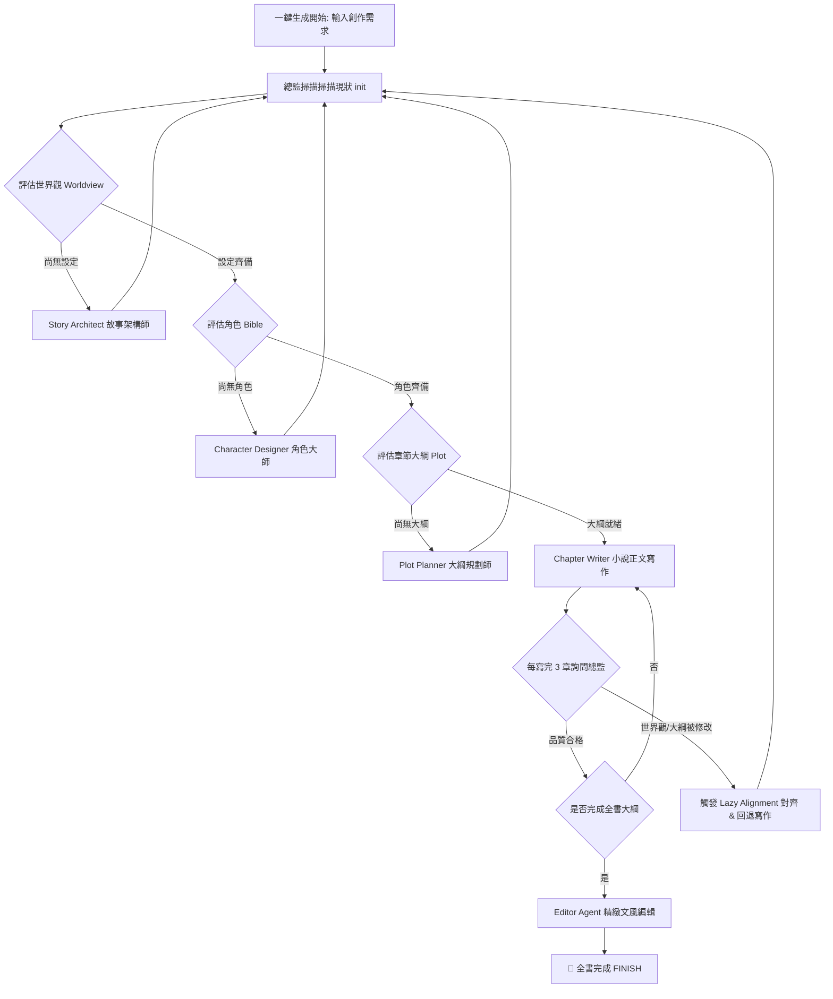
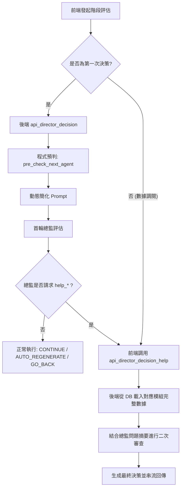

# 🧠 AI Novel Factory - 一鍵化創作流程與創意膨脹說明書 (文字版)

本說明書旨在為您詳細剖析 **AI Novel Factory (天衍小說創作工廠)** 的核心「一鍵化創作管線 (One-Click Pipeline)」運作邏輯、多智能體協同、以及新升級的「創意膨脹與自我修復循環 (Creative Swelling & Self-Healing Loop)」。

---

## 🗺️ 一、全鏈路一鍵化創作管線架構

「一鍵化創作管線」旨在打破傳統創作系統中各 Agent 各自為政的壁壘。系統以常駐的 **Co-pilot Director (AI 創意總監)** 為核心路由大腦，實施 staged (分階段) 且受監督的自動推進。

### 🔄 1. 核心流程演進圖

### ⚙️ 2. 五大智能體專職分工
1. **Story Architect (世界觀架構)**：負責生成核心主題、主衝突、三幕式結構、伏筆種子與關鍵轉折點。
2. **Character Designer (角色大師)**：從世界觀底層邏輯出發，建立包含性格標籤、致命缺陷、核心動機 (Want/Need) 的角色卡。
3. **Plot Planner (大綱大師)**：依據當前故事在全書的進度百分比，進行 **比例滑動視窗 (Sliding-window)** 的伏筆調度，每次規劃 5 個具體場景大綱。
4. **Chapter Writer (正文寫作)**：融合大綱、世界觀、角色卡與前章正文，利用 120B 推理模型展開高品質散文寫作。
5. **Editor Agent (編輯拋光)**：針對成品進行微調、潤色，滿足「打鬥動作緊湊」、「對話綿裡針」等細緻要求。

---

## ⚡ 二、創意膨脹與自我修復循環 (Creative Swelling Loop)

當大綱規劃師 (Plot Planner) 在生成第 6 章以後的大綱時，常因情節素材枯竭或上下文過載而導致 LLM 幻覺或解析 JSON 失敗。傳統系統會在此時生成機械式的 "保底佔位符"，這是不合理的。

我們最新部署的 **「創意膨脹與自我修復循環」** 完美解決了此問題：

### 1. 運作邏輯
當 Plot Planner 偵測到**大綱生成失敗或素材耗盡**時，不直接降級為垃圾佔位符，而是主動發起自我拯救：
* **步驟 A：篇卷自動擴充 (Volume Expansion)**
  若大綱進度已超出原有規劃的「卷（Volumes）」（例如每卷 50 章），系統會主動增量生成並擴充新一卷的設定（卷標題、概要、登場陣營），並縫合至 SQLite 中。
* **步驟 B：世界觀勢力擴充 (Faction Swelling)**
  呼叫創意膨脹 Agent，根據當前小說的脈絡，自動催生 1 個全新的地下勢力或財閥組織（包含其核心陰謀與動機），增量追加至世界觀中。
* **步驟 C：配角/新角色降臨 (Character Swelling)**
  為配合新勢力的誕生，在角色 Bible 的末尾增量孵化 1-2 個新角色卡（姓名、動機、致命弱點），直接縫合至 SQLite 記憶中。
* **步驟 D：新伏筆與轉折種子追加**
  產生 2-3 個與新組織高度關聯的伏筆種子，增加故事線的複雜度。
* **步驟 E：最新上下文重試 (JIT Swelling Retry)**
  設定膨脹完畢後，系統會**重新載入最新的資料庫上下文**，並將這批充滿細節、熱騰騰的全新素材（新組織、新配角、新伏筆）送入 Plot Planner 中重新生成大綱。此時，模型將能夠輕鬆生成具體且文筆豐茂的真正章節大綱！

---

## 🛡️ 三、回退（Rebound）與延遲對齊協議 (Lazy Alignment)

在長篇寫作中，正文創作與世界觀設定是一個「雙向反饋環」：

### 1. 標籤攔截與對齊
- **NEW_WORLD_LAW 攔截**：正文寫作 (Writer) 或編輯 (Editor) 在生成文字時，若突發奇想創造了新的設定，會輸出 `[NEW_WORLD_LAW: 類別 - 細節]`。
- **世界觀補丁縫合**：系統後端會自動攔截此標籤，將其作為「世界觀補丁」縫合至資料庫，不干擾正文閱讀。

### 2. 髒標記 (Dirty Flag) 與 JIT 對齊
- **下游過期標記**：一旦寫作第 $K$ 章時追加了補丁，系統會立刻將第 $K$ 章之後所有已寫正文標記為 `is_dirty = 1`，並將後續篇卷 (Volumes) 標記為髒卷。
- **動態重寫覆蓋**：當用戶再次啟動一鍵生成（`WRITE_ALL_CHAPTERS`）時，管線會**智慧篩選並過濾**掉無效的佔位符或被標記為 dirty 的髒章節，對其進行重新撰寫，而跳過 1-5 章等高品質、已對齊的歷史內容。這形成了完美的寫作閉環！

# 實作計畫：總監 Agent 指令簡化、當前重點強調與後端動態數據調閱

為了避免創意總監（Director Copilot）在評估小說創作管道時因無關階段的冗長說明與大長篇大綱細節而模糊焦點，我們將進行以下三大升級：

1. **總監 Agent 指令極簡化（Stage-Aware Simplified Prompts）**：
   - 根據當前所處的階段（如世界觀、角色、大綱、正文寫作），動態生成僅與該階段相關的總監系統提示詞（Prompt），剔除無關階段的品質紅線與檢查清單，大幅減少 Context 負擔與干擾。
2. **強調當前事項重點與程式預判（Emphasis & Programmatic Pre-Checks）**：
   - **`init` 階段特殊檢查**：當專案初次啟動（init）時，若檢測到世界觀與角色聖經均已存在，強制注入強勢提示引導總監進行細項的完整重審與對齊，否則引導其呼叫細項修改流程。
   - **其他階段程式預判**：在非 `init` 階段，由程式在總監做決定前，先從 SQLite 資料庫基本判斷當前已完成資料的健康狀態，並明確告知總監「即將呼叫的下一個 Agent 是誰」以及「資料是否確實就緒」，使總監把關更具針對性。
3. **後端驅動的 `help_*` 二次審查決策流（Backend-Driven Help Actions）**：
   - 讓總監僅在確實需要深度把關時輸出 `help_worldview`、`help_characters` 或 `help_plot`。
   - 將原先由前端組裝 Prompt 的「二次啟動」邏輯完全移至**後端處理**。後端接收到總監的摘要問題與請求後，直接在資料庫讀取最新、最完整的設定數據，並格式化為二次審核提示詞交由 LLM 重新做出決策。前端僅需呼叫 Streaming API，保持單一數據源與架構的簡潔優雅。

---

## 🎯 變更目標與架構

---

## 🛠️ 擬議變更

### 1. 後端核心邏輯

#### [MODIFY] [agents.py](file:///c:/Users/user/Desktop/test_html/新增資料夾/Write_Novel/agents.py)

- **新增 `pre_check_next_agent(novel_id, current_stage)`**：
  - 根據當前階段與 SQLite 庫中 `worldbuilding`、`characters`、`plot`、`chapters` 資料的有無與字數做基本健康度診斷。
  - 回傳格式化文字，列出「當前階段」、「準備呼叫的下一個 Agent」、「健康度狀態」與「程式建議的總監動作」。
  
- **新增 `get_simplified_director_prompt(current_stage, has_wb_and_char_at_init=False)`**：
  - 拆分原先一體化的龐大提示詞，封裝為模組化、階段特化的 Prompt。
  - 在 worldview / character 階段，完全不包含 plot 的複雜伏筆規則與 written chapters 說明，避免模糊焦點。
  
- **重構 `run_director_decision(novel_id, current_stage, user_prompt)`**：
  - 判定當前階段，從 DB 檢查 `init` 特殊狀態（世界觀與角色皆已存在）。
  - 調用 `pre_check_next_agent` 取得預判分析。
  - 調用 `get_simplified_director_prompt` 生成當前階段特化 Prompt，並格式化變數。
  
- **新增 `run_director_decision_help(novel_id, current_stage, help_action, help_reason)`**：
  - 處理總監對特定模組（`worldview`, `characters`, `plot`）的詳細數據請求。
  - 讀取資料庫對應數據，組裝包含「總監問題摘要」與「完整數據內容」的二次審核 Prompt，啟動串流。

---

### 2. 後端 API 路由

#### [MODIFY] [app.py](file:///c:/Users/user/Desktop/test_html/新增資料夾/Write_Novel/app.py)

- **新增 `DirectorHelpPayload` 模型**：
  - 包含 `current_stage: str`、`help_action: str`、`help_reason: str`。
- **新增 API 端點 `/api/novels/{novel_id}/director-decision/help`**：
  - 呼叫 `run_director_decision_help` 串流回傳總監在閱讀詳細設定後的最終二次決策。

---

### 3. 前端引導與頁面邏輯

#### [MODIFY] [app.js](file:///c:/Users/user/Desktop/test_html/新增資料夾/Write_Novel/static/app.js)

- **新增 `runDirectorDecisionHelp(currentStage, helpAction, helpReason)`**：
  - 模擬 `runDirectorDecision` 的實作，向後端 `/api/novels/{novel_id}/director-decision/help` 發起 SSE 串流請求，在右側聊天框中渲染總監二次決策過程。
- **重構 `executeDirectorAction` 中 `help_worldview` / `help_characters` / `help_plot` 的處理邏輯**：
  - 移除前端讀取 `state.currentNovelData` 以及在前端拼裝 `helpPrompt` 的舊邏輯。
  - 改為直接呼叫新寫的 `runDirectorDecisionHelp` 函數，將總監帶來的 `reason` (摘要) 傳回後端，並將二次決策結果直接送入 `executeDirectorAction` 執行。

---

## 🧪 驗證計畫

### 1. 單元與流程測試
- 我們將在 `test_pipeline_rebound.py` 中執行測試，確保 API 的正常串流運作。
- 強制在 Python 環境下執行基本編碼安全校正，嚴防 `cp950` 的中文編碼報錯。

### 2. 功能與 UI 整合測試
- **`init` 階段測試**：
  - 專案為新創時（世界觀空白），總監是否引導 `CONTINUE` 到 `worldview`。
  - 當世界觀與角色皆在資料庫中存在時，總監是否會得到「強制重新審查完整世界觀與細項」的強勢指令，並能正確做出 `CONTINUE` 進度到大綱或 `GO_BACK` 修正。
- **簡化版 Prompt 與程式預判驗證**：
  - 觀察 worldview 階段的總監 prompt 中是否剔除了無關大綱伏筆與篇卷檢驗；同時查看總監回覆中是否含有「【程式基本判斷結果】」的文字，證實程式在決策前已成功預判下一個 Agent（例如 characters）。
- **`help_*` 決策流驗證**：
  - 在大綱或世界觀階段，使總監觸發 `help_worldview` 或 `help_plot` 動作，確保後端順暢接收、動態讀取 DB 最新設定，並自動觸發流暢的二次評估，最終將決策回传執行。
s