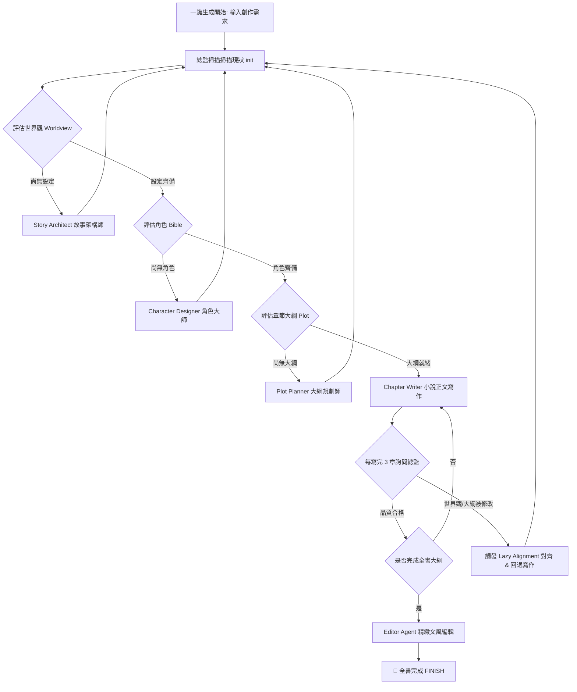

# 🧠 AI Novel Factory - 一鍵化創作流程與創意膨脹說明書 (文字版)

本說明書旨在為您詳細剖析 **AI Novel Factory (天衍小說創作工廠)** 的核心「一鍵化創作管線 (One-Click Pipeline)」運作邏輯、多智能體協同、以及新升級的「創意膨脹與自我修復循環 (Creative Swelling & Self-Healing Loop)」。

---

## 🗺️ 一、全鏈路一鍵化創作管線架構

「一鍵化創作管線」旨在打破傳統創作系統中各 Agent 各自為政的壁壘。系統以常駐的 **Co-pilot Director (AI 創意總監)** 為核心路由大腦，實施 staged (分階段) 且受監督的自動推進。

### 🔄 1. 核心流程演進圖

### ⚙️ 2. 五大智能體專職分工
1. **Story Architect (世界觀架構)**：負責生成核心主題、主衝突、三幕式結構、伏筆種子與關鍵轉折點。
2. **Character Designer (角色大師)**：從世界觀底層邏輯出發，建立包含性格標籤、致命缺陷、核心動機 (Want/Need) 的角色卡。
3. **Plot Planner (大綱大師)**：依據當前故事在全書的進度百分比，進行 **比例滑動視窗 (Sliding-window)** 的伏筆調度，每次規劃 5 個具體場景大綱。
4. **Chapter Writer (正文寫作)**：融合大綱、世界觀、角色卡與前章正文，利用 120B 推理模型展開高品質散文寫作。
5. **Editor Agent (編輯拋光)**：針對成品進行微調、潤色，滿足「打鬥動作緊湊」、「對話綿裡針」等細緻要求。

---

## ⚡ 二、創意膨脹與自我修復循環 (Creative Swelling Loop)

當大綱規劃師 (Plot Planner) 在生成第 6 章以後的大綱時，常因情節素材枯竭或上下文過載而導致 LLM 幻覺或解析 JSON 失敗。傳統系統會在此時生成機械式的 "保底佔位符"，這是不合理的。

我們最新部署的 **「創意膨脹與自我修復循環」** 完美解決了此問題：

### 1. 運作邏輯
當 Plot Planner 偵測到**大綱生成失敗或素材耗盡**時，不直接降級為垃圾佔位符，而是主動發起自我拯救：
* **步驟 A：篇卷自動擴充 (Volume Expansion)**
  若大綱進度已超出原有規劃的「卷（Volumes）」（例如每卷 50 章），系統會主動增量生成並擴充新一卷的設定（卷標題、概要、登場陣營），並縫合至 SQLite 中。
* **步驟 B：世界觀勢力擴充 (Faction Swelling)**
  呼叫創意膨脹 Agent，根據當前小說的脈絡，自動催生 1 個全新的地下勢力或財閥組織（包含其核心陰謀與動機），增量追加至世界觀中。
* **步驟 C：配角/新角色降臨 (Character Swelling)**
  為配合新勢力的誕生，在角色 Bible 的末尾增量孵化 1-2 個新角色卡（姓名、動機、致命弱點），直接縫合至 SQLite 記憶中。
* **步驟 D：新伏筆與轉折種子追加**
  產生 2-3 個與新組織高度關聯的伏筆種子，增加故事線的複雜度。
* **步驟 E：最新上下文重試 (JIT Swelling Retry)**
  設定膨脹完畢後，系統會**重新載入最新的資料庫上下文**，並將這批充滿細節、熱騰騰的全新素材（新組織、新配角、新伏筆）送入 Plot Planner 中重新生成大綱。此時，模型將能夠輕鬆生成具體且文筆豐茂的真正章節大綱！

---

## 🛡️ 三、回退（Rebound）與延遲對齊協議 (Lazy Alignment)

在長篇寫作中，正文創作與世界觀設定是一個「雙向反饋環」：

### 1. 標籤攔截與對齊
- **NEW_WORLD_LAW 攔截**：正文寫作 (Writer) 或編輯 (Editor) 在生成文字時，若突發奇想創造了新的設定，會輸出 `[NEW_WORLD_LAW: 類別 - 細節]`。
- **世界觀補丁縫合**：系統後端會自動攔截此標籤，將其作為「世界觀補丁」縫合至資料庫，不干擾正文閱讀。

### 2. 髒標記 (Dirty Flag) 與 JIT 對齊
- **下游過期標記**：一旦寫作第 $K$ 章時追加了補丁，系統會立刻將第 $K$ 章之後所有已寫正文標記為 `is_dirty = 1`，並將後續篇卷 (Volumes) 標記為髒卷。
- **動態重寫覆蓋**：當用戶再次啟動一鍵生成（`WRITE_ALL_CHAPTERS`）時，管線會**智慧篩選並過濾**掉無效的佔位符或被標記為 dirty 的髒章節，對其進行重新撰寫，而跳過 1-5 章等高品質、已對齊的歷史內容。這形成了完美的寫作閉環！
